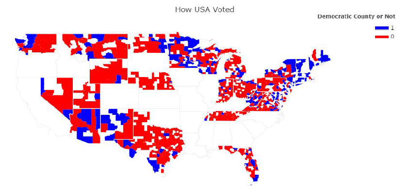

# US Election Data Exploration

This project was done as a course assignment for CS418: Introduction to Data Science course at the University of Illinois at Chicago during the Fall 2019 term along with teammates [Yushenli1996](https://github.com/Yushenli1996) and [nathanhe789](https://github.com/nathanhe789).

----

We were provided with the dataset by the Professor. There were 2 CSV files: one contained [demographics data](demographics_train.csv) of counties of certain US states and the other contained [election data](election_train.csv) of counties of certain US states from the 2016 US Senate elections.

We had to merge both files as a single data file. Before merging we had to address the inconsistencies in both the data files like:

* The election data file was in long format while the demographic data was in wide format. 
* The state and county names in both data files were in different formats.

-------------------------------------------------------

The main purpose of the assignment was to perform Exploratory Data Analysis on the demographic-election data. The data exploration tasks performed on the dataset are:

* Check for redundant/irrelevant variables

* Check for missing values 

* Perform null hypothesis on mean population and mean median household income of each county

* Compute descriptive statistic and create box plots for each demographic feature

* Identify the features in the dataset most important to determine whether a county should be labelled as Democratic or Republican.  

* Create choropleth map to visualize the majority political party of each county

  

----------

Check out the [Jupyter Notebook](US_Election_data.ipynb "US Election Data Exploration") or [the project report](Report.pdf "Project Report") to see the data science flow implemented.
